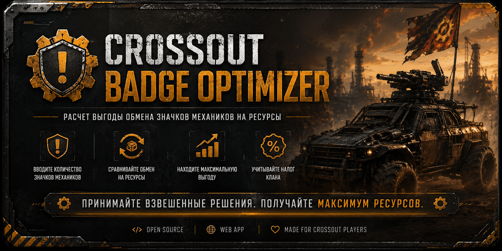
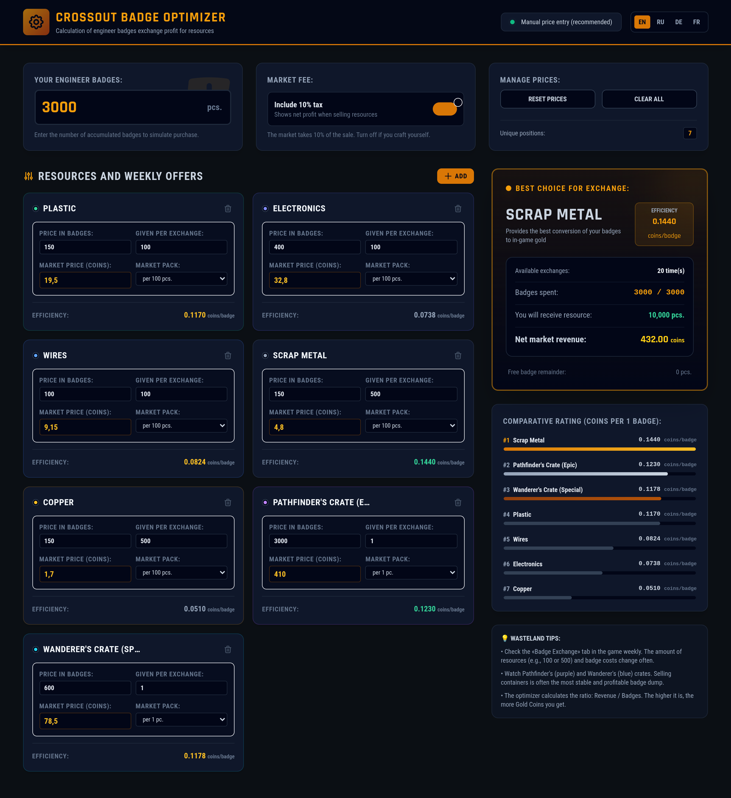

# Crossout Badge Optimizer

<p align="center">
  
</p>

<p align="center">
  <strong>Find the most profitable way to exchange Mechanic Badges in Crossout.</strong>
</p>

<p align="center">
  🇺🇸 <a href="README.md">English</a> •
  🇷🇺 <a href="README.ru.md">Русский</a> •
  🇩🇪 <a href="README.de.md">Deutsch</a> •
  🇫🇷 <a href="README.fr.md">Français</a>
</p>

<p align="center">
  
  
  
  
</p>

---

## 🚀 Overview

**Crossout Badge Optimizer** is a lightweight web application that helps players maximize the value of their Mechanic Badges.

The tool automatically compares all available resource exchanges, applies market taxes, calculates profitability, and determines which exchange option provides the highest return.

Instead of spending badges based on guesswork, you can make data-driven decisions and earn more Coins from every exchange.

---

## ✨ Features

* Real-time profitability calculations
* Coins-per-badge efficiency analysis
* Automatic ranking of exchange options
* Market tax support (10%)
* Editable market prices
* Support for custom resources
* Responsive user interface
* Fast and lightweight
* No backend required
* No account required
* Fully client-side application

---

## 📊 How It Works

For each available exchange option the application calculates:

```text
Net Market Value ÷ Badge Cost
```

The optimizer evaluates:

* Resource quantity
* Badge cost
* Current market value
* Market tax deduction
* Net profit
* Coins per badge ratio
* Overall efficiency score

Results are automatically sorted from the most profitable option to the least profitable.

---

## 🖼 Screenshot

<p align="center">
  
</p>

---

## 🛠 Technology Stack

### Frontend

* HTML5
* Tailwind CSS
* Vanilla JavaScript

### Deployment

* GitHub Pages
* Static Hosting
* No Build Process

---

## 📦 Installation

Clone the repository:

```bash
git clone https://github.com/YOUR_USERNAME/crossout-badge-optimizer.git
```

Navigate into the project directory:

```bash
cd crossout-badge-optimizer
```

Open:

```text
index.html
```

in your preferred browser.

No dependencies or build tools are required.

---

## 🎮 Usage

1. Open the application.
2. Enter current market prices.
3. Specify available Mechanic Badges.
4. Review profitability rankings.
5. Exchange badges using the highest-value option.

---

## 📈 Example

| Resource    | Badge Cost | Market Value | Coins/Badge |
| ----------- | ---------: | -----------: | ----------: |
| Plastic     |        300 |          540 |        1.80 |
| Electronics |        800 |         1480 |        1.85 |
| Batteries   |        600 |          980 |        1.63 |

The optimizer automatically identifies the most profitable exchange.

---

## 🗺 Roadmap

* [ ] CrossoutDB integration
* [ ] Automatic market price updates
* [ ] Price history charts
* [ ] Profit trend analysis
* [ ] Export to CSV
* [ ] Export to Excel
* [ ] Multi-language UI
* [ ] Mobile-first redesign

---

## 🤝 Contributing

Contributions are welcome.

If you would like to improve the project:

1. Fork the repository.
2. Create a feature branch.
3. Commit your changes.
4. Open a Pull Request.

Bug reports and feature suggestions are greatly appreciated.

---

## ⚠ Disclaimer

Crossout®, Gaijin Entertainment®, and all related trademarks belong to their respective owners.

This project is an independent fan-made utility and is not affiliated with, endorsed by, or sponsored by Gaijin Entertainment or Targem Games.

---

## 📄 License

Released under the MIT License.

See the LICENSE file for more information.

---

<p align="center">
  Made with ❤️ by Crossout players for Crossout players.
</p>
