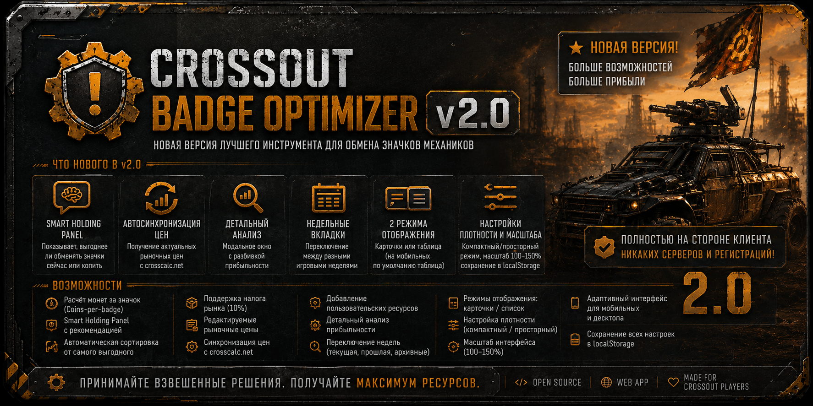
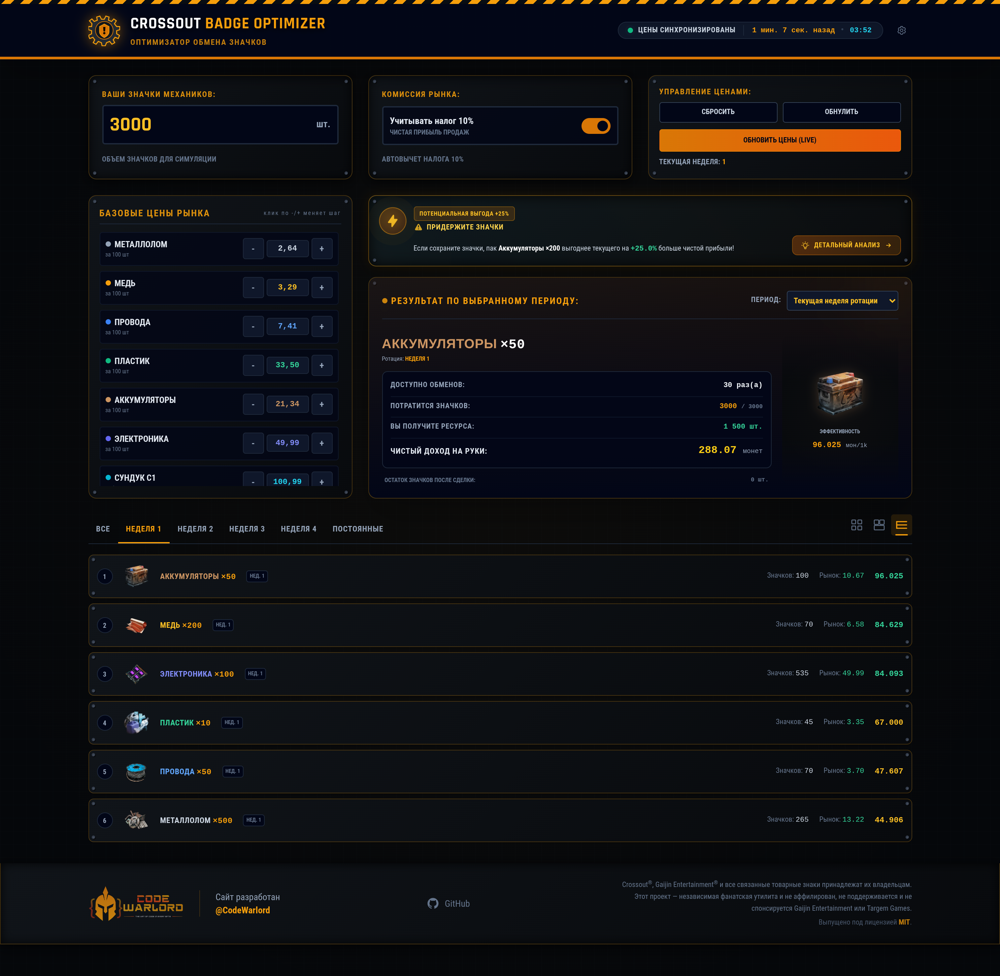
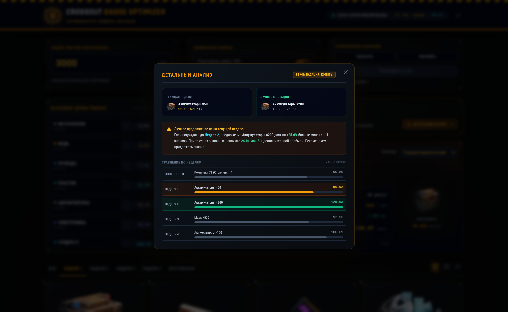

# Crossout Badge Optimizer v2.0

<p align="center">
  
</p>

<p align="center">
  <strong>Найдите наиболее выгодный способ обмена значков механика в Crossout.</strong>
</p>

<p align="center">
  
  
  
</p>

## 🚀 Обзор

**Crossout Badge Optimizer v2.0** — полностью переработанное веб-приложение для эффективного обмена значков механиков. Автоматически рассчитывает прибыльность каждого варианта обмена с учётом рыночных цен, налога и количества доступных значков.

### Что нового в v2.0

- **Smart Holding Panel** — интеллектуальная панель, показывающая, выгоднее ли обменять значки сейчас или копить на более ценный ресурс
- **Автосинхронизация цен** — получение актуальных рыночных цен с crosscalc.net одним нажатием
- **Детальный анализ** — модальное окно с разбивкой прибыльности каждого ресурса
- **Недельные вкладки** — переключение между разными игровыми неделями
- **Два режима отображения** — карточки или таблица (на мобильных по умолчанию таблица)
- **Настройки плотности и масштаба** — компактный/просторный режим, сохранение в localStorage
- **Адаптивный дизайн** — с мобильной и десктопной версией футера
- **Полностью на стороне клиента** — никаких серверов и регистраций

## ✨ Возможности

- Расчёт монет за значок (Coins-per-badge) для каждого ресурса
- Smart Holding Panel с рекомендацией «Обменять сейчас» или «Копить»
- Автоматическая сортировка от самого выгодного к наименее выгодному
- Поддержка налога рынка (10%)
- Редактируемые рыночные цены
- Синхронизация цен с crosscalc.net (с индикатором статуса)
- Добавление пользовательских ресурсов
- Детальный анализ прибыльности в модальном окне
- Переключение недель (текущая, прошлая, архивные)
- Режимы отображения: карточки / список
- Настройка плотности (компактный / просторный)
- Масштаб интерфейса (100–150%)
- Адаптивный интерфейс для мобильных и десктопа
- Сохранение всех настроек в localStorage

## 📊 Как это работает

Для каждого доступного варианта обмена приложение вычисляет:

```
Чистая рыночная стоимость ÷ Стоимость в значках
```

Оптимизатор учитывает:
- Количество ресурса в обмене
- Стоимость в значках
- Текущую рыночную цену
- Вычет налога рынка (10%)
- Чистую прибыль после налога
- Соотношение монет за значок
- Общую эффективность

**Smart Holding Panel** дополнительно анализирует, выгоднее ли потратить значки сейчас на доступные ресурсы или подождать следующей недели для более ценных вариантов.

## 🖼 Скриншоты

<p align="center">
  
</p>

<p align="center">
  
</p>

## 🛠 Технологии

- HTML5
- Tailwind CSS (CDN)
- Vanilla JavaScript (ES6+)
- Font Awesome (иконки)

Без бэкенда, без сборки, без зависимостей.

## 📦 Установка

```bash
git clone https://github.com/y-tretyakov/crossout-badge-optimizer.git
cd crossout-badge-optimizer
```

Откройте `index.html` в любом современном браузере.

## 🎮 Использование

1. Откройте приложение.
2. Нажмите «Синхронизировать цены» для получения актуальных рыночных цен (или введите вручную).
3. Просмотрите ранжированные варианты обмена.
4. Smart Holding Panel покажет, стоит ли обменивать значки сейчас.
5. Нажмите «Детальный анализ» для полной разбивки по ресурсам.
6. Переключайтесь между неделями через вкладки вверху.
7. Настройте режим отображения (карточки/список) и плотность под себя.

## ⚠ Ограничение ответственности

Crossout®, Gaijin Entertainment® и все связанные товарные знаки принадлежат их владельцам.

Этот проект — независимая фанатская утилита и не аффилирован, не поддерживается и не спонсируется Gaijin Entertainment или Targem Games.

## 📄 Лицензия

Выпущено под лицензией MIT.

---

<p align="center">
  <a href="https://t.me/y-tretyakov">Telegram</a> •
  <a href="https://github.com/y-tretyakov">GitHub</a>
</p>

<p align="center">
  Сделано с ❤️ игроками Crossout для игроков Crossout.
</p>
